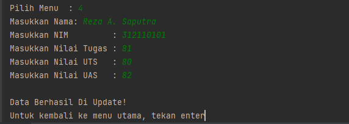

# Berikut adalah hasil praktikum UAS Mata Kuliah Pemrograman - Python

## Dengan ketentuan:
- daftar_nilai.py berisi modul untuk tambah data, ubah data, cari data, hapus data
- cetak_nilai.py berisi modul untuk cetak daftar nilai, cetak hasil pencarian
- input_nilai.py berisi modul untuk input data yang diminta pengguna untuk memasukkan data
- main.py berisi program secara keseluruhan


- Susunan package dan modul nya akan terlihat seperti di bawah ini


- dibawah adalah script untuk daftar_nilai.py
```python
from view.input_nilai import *

dataMahasiswa = {}


def tambah_data():
    global dataMahasiswa
    nama = input_nama()
    nim = input_nim()
    nilaiTugas = input_nilaiTugas()
    nilaiUts = input_nilaiUts()
    nilaiUas = input_nilaiUas()
    nilaiAkhir = (0.30 * nilaiTugas) + (0.35 * nilaiUts) + (0.35 * nilaiUas)
    dataMahasiswa[nama] = nim, nilaiTugas, nilaiUts, nilaiUas, nilaiAkhir
    print("\nData Berhasil Ditambahkan!")
    return dataMahasiswa

def ubah_data():
    nama = input("Masukkan Nama: ")
    if nama in dataMahasiswa.keys():
        nim = input_nim()
        nilaiTugas = input_nilaiTugas()
        nilaiUts = input_nilaiUts()
        nilaiUas = input_nilaiUas()
        nilaiAkhir = (0.30 * nilaiTugas) + (0.35 * nilaiUts) + (0.35 * nilaiUas)
        dataMahasiswa[nama] = nim, nilaiTugas, nilaiUts, nilaiUas, nilaiAkhir
        print("\nData Berhasil Di Update!")
    else:
        print("Data tidak ditemukan!")


def hapus_data():
    nama = input("Masukkan Nama:  ")
    if nama in dataMahasiswa.keys():
        del dataMahasiswa[nama]
        print("Data",nama, "Telah dihapus!")
    else:
        print("Data Mahasiswa Tidak Ada".format(nama))
```

- Berikut adalah script untuk cetak_nilai.py
```python
from model.daftar_nilai import *


def cetak_daftar_nilai():
    if dataMahasiswa.items():
        print("\n                      DAFTAR NILAI MAHASISWA                    ")
        print("==================================================================")
        print("| No |     Nama     |    NIM    | Tugas |  UTS  |  UAS  |  Akhir |")
        print("==================================================================")
        i = 0
        for x in dataMahasiswa.items():
            i += 1
            print("| {6:2} | {0:12s} | {1:9s} | {2:5} | {3:5} | {4:5} | {5:6} |".format(x[0], x[1][0], x[1][1], x[1][2], x[1][3], x[1][4], i))
        print("==================================================================")
    else:
        print("\n                      DAFTAR NILAI MAHASISWA                    ")
        print("==================================================================")
        print("| No |     Nama     |    NIM    | Tugas |  UTS  |  UAS  |  Akhir |")
        print("==================================================================")
        print("|                          TIDAK ADA DATA!                       |")
        print("==================================================================")


def cetak_hasil_pencarian():
    nama = input("Masukkan Nama        : ")
    if nama in dataMahasiswa.keys():
        print("\n                   DAFTAR NILAI MAHASISWA                   ")
        print("==============================================================")
        print("|     Nama     |    NIM    | Tugas |  UTS  |  UAS  |  Akhir  |")
        print("==============================================================")
        print("| {0:12s} | {1:9s} | {2:5} | {3:5} | {4:5} | {5:6}  |".format(nama, dataMahasiswa[nama][0], dataMahasiswa[nama][1], dataMahasiswa[nama][2], dataMahasiswa[nama][3], dataMahasiswa[nama][4]))
        print("==============================================================")
    else:
        print("Datanya {0} Tidak Ada ".format(nama))
```

- Berikut adalah script untuk input_nilai.py
```python
def input_nama():
    global nama
    nama = input("Masukkan Nama        : ")
    return nama


def input_nim():
    global nim
    nim = input("Masukkan NIM         : ")
    return nim


def input_nilaiTugas():
    global nilaiTugas
    nilaiTugas = int(input("Masukkan Nilai Tugas : "))
    return nilaiTugas


def input_nilaiUts():
    global nilaiUts
    nilaiUts = int(input("Masukkan Nilai UTS   : "))
    return nilaiUts


def input_nilaiUas():
    global nilaiUas
    nilaiUas = int(input("Masukkan Nilai UAS   : "))
    return nilaiUas
```

- Dan berikut adalah script untuk main.py
```python
from view.cetak_nilai import *


def menu():
    print('=====================================')
    print('Input Data Nilai Mahasiswa'.center(40))
    print('=====================================')
    print('|    1. Tambah Data                 |')
    print('|    2. Cari Data                   |')
    print('|    3. Tampilkan Data Mahasiswa    |')
    print('|    4. Ubah Data Mahasiswa         |')
    print('|    5. Hapus Data Mahasiswa        |')
    print('|    6. Selesai                     |')
    print('=====================================')


while True:
    menu()
    choose = input('Pilih Menu  : ')

    if choose == '1':
        tambah_data()
        input('Untuk kembali ke menu utama, tekan enter')

    elif choose == '2':
        cetak_hasil_pencarian()
        input('Untuk kembali ke menu utama, tekan enter')

    elif choose == '3':
        cetak_daftar_nilai()
        input('Untuk kembali ke menu utama, tekan enter')

    elif choose == '4':
        ubah_data()
        input('Untuk kembali ke menu utama, tekan enter')

    elif choose == '5':
        hapus_data()
        input('Untuk kembali ke menu utama, tekan enter')

    elif choose == '6':
        exit()

    else:
        print("Menu yang anda maksud tidak tersedia, Silahkan pilih menu yang tersedia")
```

- Dibawah adalah hasil program ketika dijalankan, dan menampilkan menu utama


- Dibawah adalah hasil ketika program dijalankan, dan input angka 1 pada keyboard, untuk menambah data


- Dibawah adalah hasil program ketika dijalankan, dan input angka 2 pada keyboard, untuk mencari data dengan prompt masukkan nama yang ingin di cari


- Dibawah adalah hasil ketika program dijalankan, dan input angka 1 pada keyboard, untuk melakukan penambahan data, disini kita tambahkan data Gilang


- Dibawah adalah hasil ketika program dijalankan, dan input angka 3 pada keyboard, untuk melihat semua daftar data yang ada


- Dibawah adalah hasil ketika program dijalankan, dan input angka 4 pada keyboard, untuk merubah data, disini kita ubah data nilai pada nama Reza A. Saputra



- Dan untuk melihat apakah data telah terupdate, maka kita input angka 3 pada keyboard, untuk melihat daftar data yang ada, disini sudah terlihat bahwa data Reza A. Saputra sudah terupdate nilai nya


- Dibawah adalah hasil ketika program dijalankan, dan input angka 5 pada keyboard, untuk perintah hapus data, dengan prompt masukkan nama data yang ingin di hapus, disini kita akan menghapus data dengan nama Gilang


- Dibawah adalah hasil ketika program dijalankan, dan input angka 3 pada keyboard, untuk melihat daftar yang ada, karena adanya penghapusan data, apakah data dengan nama Gilang sudah terhapus atau belum


- diBawah adalah ketika program dijalankan, dan input angka 6 pada keyboard, untuk selesai atau keluar dari program


